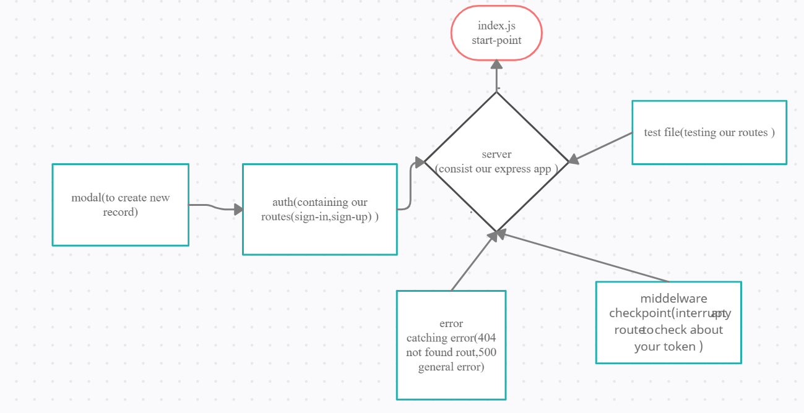

# bearer-auth
## heroku:https://marwan-bearer-auth.herokuapp.com/
## pull-req:https://github.com/marwanrawshedh/bearer-auth/pull/2

on lab 401-07 i take the starter code as that written in the lab guideline ,
I installed all the dependencies(dotenv ,express,jest,supertest,sqlite3,sequelize,pg)
after that I start debug this starter code to dsicover and fix it's problems.

before the deployment I tested my code and everything went fine.
finally I did ACP and merged dev branch with main branch.
and regarding heroku deployment i did as it is required i added the config var.

